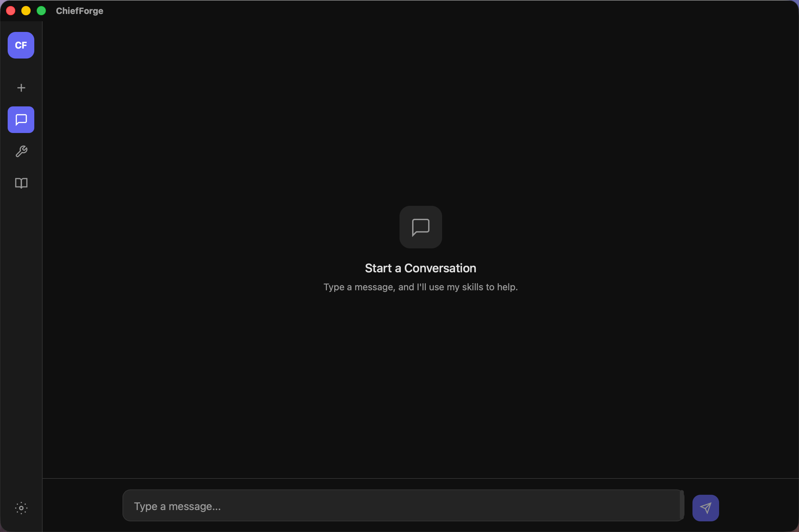
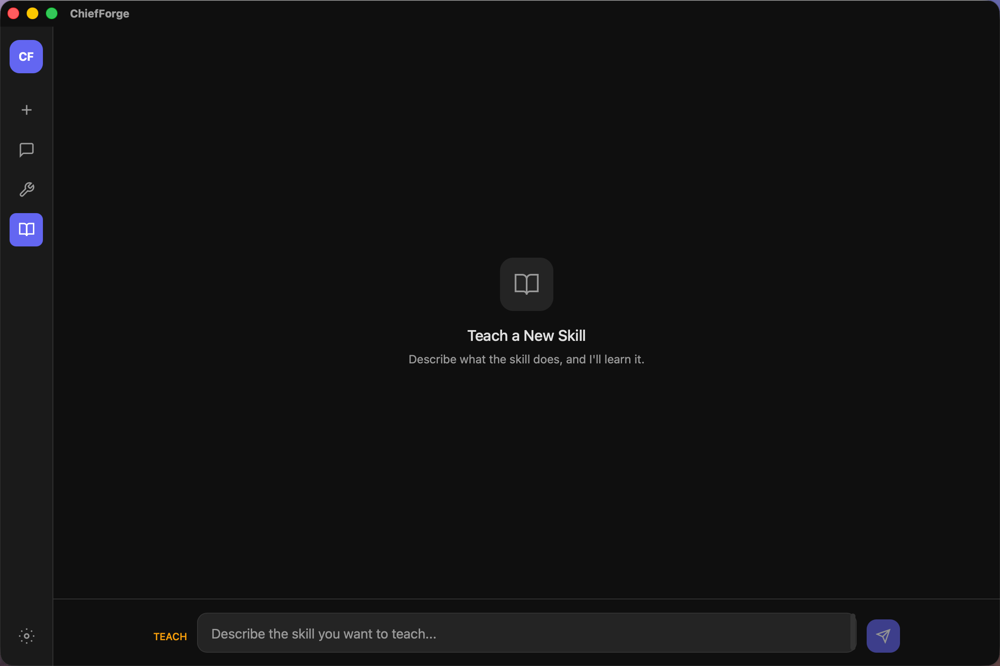

<div align="center">


# ChiefForge

### AI That Learns Your Skills

A next-generation desktop AI assistant you can teach.
Describe any workflow in natural language, and ChiefForge turns it into an executable skill — forever.

[](https://github.com/novaair026-dev/ChiefForge/releases)
[](https://github.com/novaair026-dev/ChiefForge/releases)

**Rust** · **Tauri v2** · **React 19** · **TypeScript** · **SQLite**

</div>

---

## Screenshots

<table>
<tr>
<td width="50%">



**Chat Mode** — Intelligent conversations powered by your custom skills. Type a message and the AI automatically activates the right skill to help.

</td>
<td width="50%">



**Teach Mode** — Describe any workflow and the AI learns it instantly. Skills are saved locally and persist across sessions.

</td>
</tr>
</table>

---

## Why ChiefForge?

Most AI assistants are frozen at release. They can't learn new tricks.

**ChiefForge is different.** You teach it skills through conversation. It remembers them. It uses them automatically. The more you teach, the smarter it gets — tailored entirely to your workflow.

> Teach once. Use forever.

---

## Features

### Skill Learning Engine

Teach the AI any workflow through natural conversation. Describe what you want — the AI asks clarifying questions, then generates a structured, reusable skill definition automatically. No code required.

### Intelligent Routing

Every message is analyzed in real-time. The AI automatically selects and activates the most relevant skills from your library. No manual skill selection, no menus — just ask and the right skill fires.

### Agentic Execution

Skills aren't just definitions — they come alive. The AI runs shell commands, reads/writes files, and makes HTTP requests in an autonomous loop until the task is complete. Results stream back in real-time.

### Cross-Platform

Built on Tauri v2, ChiefForge runs natively on **macOS**, **Windows**, and **Linux** with a tiny bundle size and low memory footprint. One codebase, three platforms.

### Sandboxed Safety

Every tool execution runs within a configurable sandbox. Blocked commands, timeout guards, and file size limits keep your system safe while giving the AI the power to act.

### Rich Rendering

Full Markdown with syntax-highlighted code blocks, LaTeX math via KaTeX, and streaming token-by-token responses. A polished conversational experience.

---

## How It Works

```
┌─────────┐         ┌─────────┐         ┌─────────┐
│         │         │         │         │         │
│  TEACH  │ ──────▶ │  ROUTE  │ ──────▶ │ EXECUTE │
│         │         │         │         │         │
└─────────┘         └─────────┘         └─────────┘
 Describe a          AI analyzes         Skill runs
 skill in            your message        tools auto-
 plain text          and picks the       matically:
 — the AI            right skill         shell, file
 learns it           from your           I/O, HTTP
 instantly.          library.            requests.
```

**Step 1 — Teach:** Open Teach mode and describe the skill you want. The AI asks questions, then generates a complete skill definition with tools, parameters, and system prompts.

**Step 2 — Route:** Switch to Chat mode and send a message. The skill router analyzes your intent and automatically activates the most relevant skill — no manual selection needed.

**Step 3 — Execute:** The skill's tools run autonomously in an agentic loop. Shell commands, file operations, HTTP calls — all streamed back in real-time until the task is done.

---

## Tech Stack

| Layer | Technology | Purpose |
|-------|-----------|---------|
| **Backend** | Rust | Core logic, performance, safety |
| **Framework** | Tauri v2 | Native desktop, cross-platform |
| **Frontend** | React 19 + TypeScript | UI components, state management |
| **Styling** | Tailwind CSS v4 | Dark theme, responsive design |
| **Database** | SQLite (sqlx) | Skills, conversations, settings |
| **Build** | Vite | Fast HMR, optimized bundles |
| **AI** | OpenAI-compatible API | Chat completions, streaming |
| **Math** | KaTeX | LaTeX formula rendering |

---

## Architecture

```
┌──────────────────────────────────────────────────────┐
│                    Tauri v2 Shell                     │
├───────────────────┬──────────────────────────────────┤
│  React Frontend   │         Rust Backend             │
│                   │                                  │
│  ┌─────────────┐  │  ┌──────────┐   ┌────────────┐  │
│  │ ChatPanel   │  │  │  Engine  │───│   Router   │  │
│  │ TeachPanel  │◀─┼─▶│ (agentic │   │ (skill     │  │
│  │ SkillsList  │  │  │  loop)   │   │  matching) │  │
│  │ Settings    │  │  └────┬─────┘   └────────────┘  │
│  └─────────────┘  │       │                          │
│                   │  ┌────▼──────┐   ┌────────────┐  │
│                   │  │ Executor  │   │  Learner   │  │
│                   │  │ ┌───────┐ │   │ (teach     │  │
│                   │  │ │ shell │ │   │  mode)     │  │
│                   │  │ │ file  │ │   └────────────┘  │
│                   │  │ │ http  │ │                    │
│                   │  │ └───────┘ │   ┌────────────┐  │
│                   │  └───────────┘   │   SQLite   │  │
│                   │                  │  Database   │  │
│                   │                  └────────────┘  │
├───────────────────┴──────────────────────────────────┤
│               macOS / Windows / Linux                │
└──────────────────────────────────────────────────────┘
```

---

## Quick Start

### Download & Install

Head to the [Releases](https://github.com/novaair026-dev/ChiefForge/releases) page and download the installer for your platform:

| Platform | File | Note |
|----------|------|------|
| **macOS** | `ChiefForge_x.x.x_aarch64.dmg` | Apple Silicon (M1/M2/M3/M4) |
| **macOS** | `ChiefForge_x.x.x_x64.dmg` | Intel Mac |
| **Windows** | `ChiefForge_x.x.x_x64-setup.exe` | 64-bit Windows 10/11 |

> **macOS users:** If prompted with "unidentified developer", right-click the app → Open → Open to bypass Gatekeeper.

Double-click the downloaded file to install, then launch ChiefForge from your Applications folder (macOS) or Start Menu (Windows).

---

## Configuration

On first launch, open **Settings** (gear icon) and configure:

| Setting | Description |
|---------|-------------|
| **API Base URL** | Your OpenAI-compatible API endpoint |
| **API Key** | Your API key for authentication |
| **Model** | Model name (e.g., `gpt-4o`, `deepseek-chat`) |

ChiefForge works with any OpenAI-compatible API: OpenAI, Azure OpenAI, DeepSeek, Ollama, LM Studio, and more.

---

## Skill Example

Here's what a skill definition looks like under the hood:

```json
{
  "name": "Text to Speech",
  "description": "Read text aloud using system speech synthesis",
  "system_prompt": "You are a text-to-speech assistant. Use the say_text tool to read text aloud.",
  "tools": [
    {
      "name": "say_text",
      "description": "Speak text using system TTS",
      "tool_type": "shell",
      "parameters": {
        "type": "object",
        "properties": {
          "command": {
            "type": "string",
            "description": "The say command to execute"
          }
        },
        "required": ["command"]
      }
    }
  ],
  "tags": ["audio", "tts", "speech"]
}
```

You don't write this JSON — the AI generates it through conversation in Teach mode.

---

## Feedback & Support

Have questions or found a bug? We'd love to hear from you:

- **[Report a Bug](https://github.com/novaair026-dev/ChiefForge/issues)** — Submit an issue on GitHub
- **[Feature Request](https://github.com/novaair026-dev/ChiefForge/issues)** — Suggest new features or improvements

---

## License

This project is proprietary software. All rights reserved. See [LICENSE](LICENSE) for details.

---

<div align="center">

**[Download](https://github.com/novaair026-dev/ChiefForge/releases)** · **[Report Bug](https://github.com/novaair026-dev/ChiefForge/issues)**

Built with Rust & React — by the ChiefForge team.

</div>
